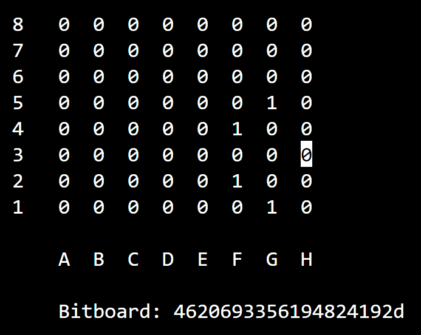

# mask\_knight\_attacks

* int square -> indica la posizione sulla scacchiera


```c
U64 mask_knight_attacks(int square){
    U64 attacks = 0ULL;
    U64 bitboard = 0ULL;

    set_bit(bitboard, square);

    if ((bitboard >> 17) & not_h_file) attacks |= (bitboard >> 17);
    if ((bitboard >> 15) & not_a_file) attacks |= (bitboard >> 15);
    if ((bitboard >> 10) & not_hg_file) attacks |= (bitboard >> 10);
    if ((bitboard >> 6) & not_ab_file) attacks |= (bitboard >> 6);
    if ((bitboard << 17) & not_a_file) attacks |= (bitboard << 17);
    if ((bitboard << 15) & not_h_file) attacks |= (bitboard << 15);
    if ((bitboard << 10) & not_ab_file) attacks |= (bitboard << 10);
    if ((bitboard << 6) & not_hg_file) attacks |= (bitboard << 6);

    return attacks;
}
```


Questa funzione genera i bit che possono essere attaccati da un cavallo in qualsiasi momento, in base alla posizione sulla scacchiera (Il colore per il cavallo è irrilevante).

Partendo da una scacchiera vuota, viene posizionato un cavallo sulla scacchiera e si fanno le stesse considerazioni che ho spiegato nel dettaglio nella funzione [`mask_pawn_attacks`](mask\_pawn\_attacks.md)

Unica cosa che cambia è che non teniamo traccia del colore del cavallo poichè indifferente.

<figure><figcaption><p>Cavallo in c2: può attaccare b4, d4, e3, e1, a1 e a3</p></figcaption></figure>

<figure><figcaption><p>Cavallo in h3: può attaccare solo g1, f2, f4 e g5</p></figcaption></figure>
