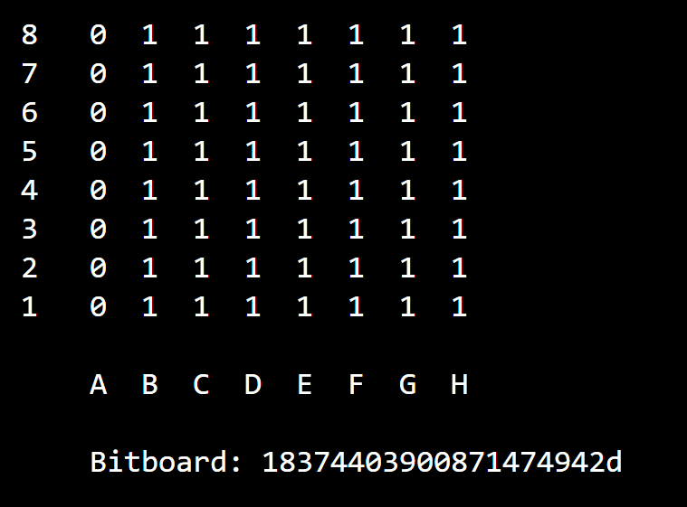
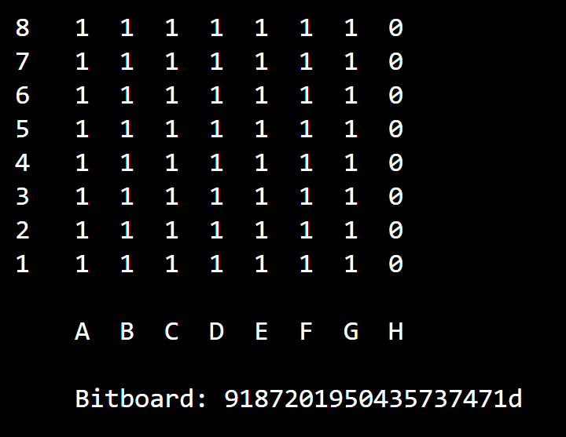
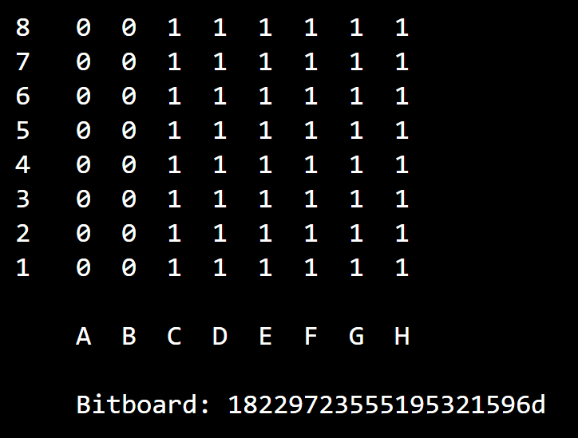
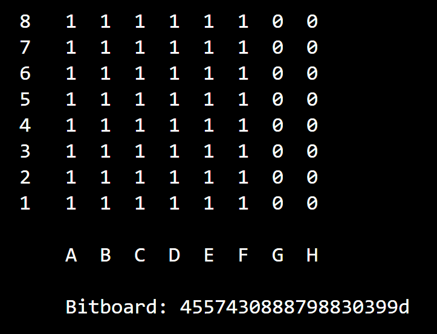

# Special Bitboards

## not\_a\_file

```c
const U64 not_a_file = 18374403900871474942ULL;
```

<figure><figcaption></figcaption></figure>

## not\_h\_file

```c
const U64 not_h_file = 9187201950435737471ULL;
```

<figure><figcaption></figcaption></figure>

## not\_ab\_file

```c
const U64 not_ab_file = 18229723555195321596ULL;
```

<figure><figcaption></figcaption></figure>

## not\_hg\_file

```c
const U64 not_hg_file = 4557430888798830399ULL;
```

<figure><figcaption></figcaption></figure>
