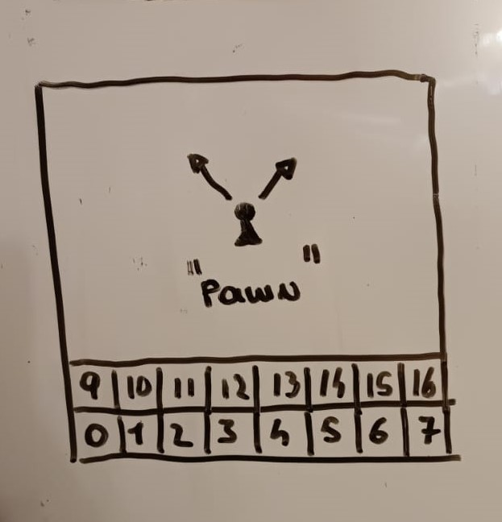
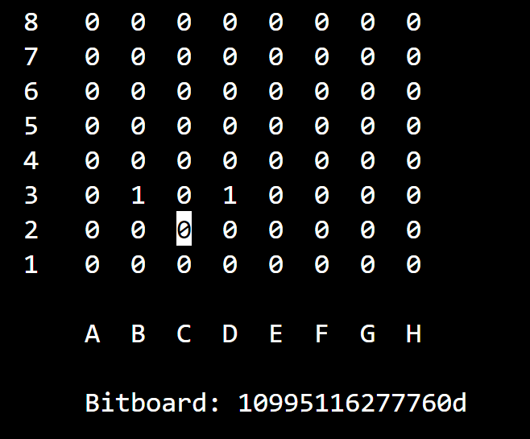
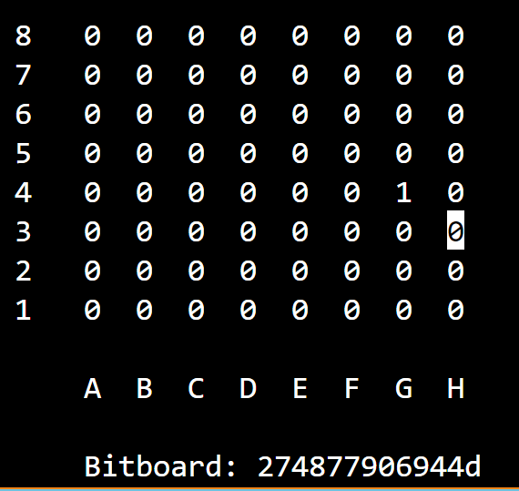

# mask\_pawn\_attacks

* int side -> indica se la pedina è Bianca o Nera
* int square -> indica la posizione sulla scacchiera

<pre class="language-c" data-line-numbers><code class="lang-c">U64 mask_pawn_attacks(int side, int square){

    U64 attacks = 0ULL;
    U64 bitboard = 0ULL;

    set_bit(bitboard, square);
    
<strong>    if (!side){
</strong>        if ((bitboard >> 7) &#x26; not_a_file) attacks |= (bitboard >> 7);
        if ((bitboard >> 9) &#x26; not_h_file) attacks |= (bitboard >> 9);
    }
    else{
        if ((bitboard &#x3C;&#x3C; 7) &#x26; not_h_file) attacks |= (bitboard &#x3C;&#x3C; 7);
        if ((bitboard &#x3C;&#x3C; 9) &#x26; not_a_file) attacks |= (bitboard &#x3C;&#x3C; 9);    
    }

    return attacks;
}
</code></pre>

Questa funzione genera i bit che possono essere attaccati da una pedina in qualsiasi momento, in base al colore e all posizione sulla scacchiera.

Partendo da una scacchiera vuota, viene posizionata una pedina sulla scacchiera e si fanno delle considerazioni a seconda se la pedina è bianca o nera (spiego solo nel caso in cui la pedina sia bianca: !side, perchè l'altro caso è analogo e speculare) sul se è legale o meno l'attacco (tenendo in considerazione SOLO la posizione):

<figure><figcaption></figcaption></figure>

Supponiamo che la pedina si trovi nella casella 3 (d4) e che possa attaccare in alto a sinistra (11) o in alto a destra (13); se la pedina è vista come unico bit posto a 1 sulla scacchiera, i bit che rappresentano l'attacco si ottengono facendo uno shift aritmetico (>>) di 7 bit e di 9 bit.

```c
if ((bitboard >> 7) & not_a_file) attacks |= (bitboard >> 7);
if ((bitboard >> 9) & not_h_file) attacks |= (bitboard >> 9);
```

[not\_a\_file](../costanti/special-bitboards.md#not\_a\_file) e [not\_h\_file](../costanti/special-bitboards.md#not\_h\_file) sono delle bitboards speciali che discrimininano i casi in cui la pedina si trovi sulla prima e sull'ultima riga: in questi casi alcune prese uscirebbero fuori dalla scacchiera.\
Se le condizioni vengono verificate, viene effettuato un OR bit a bit tra attacks (la scacchiera che funge da return) e la scacchiera su cui è posizionata la pedina shiftata di 7 o di 9

<figure><figcaption><p>Pedina in c2: può attaccare b3 e d3</p></figcaption></figure>

<figure><figcaption><p>Pedina in h3 può attaccare solo g4</p></figcaption></figure>
